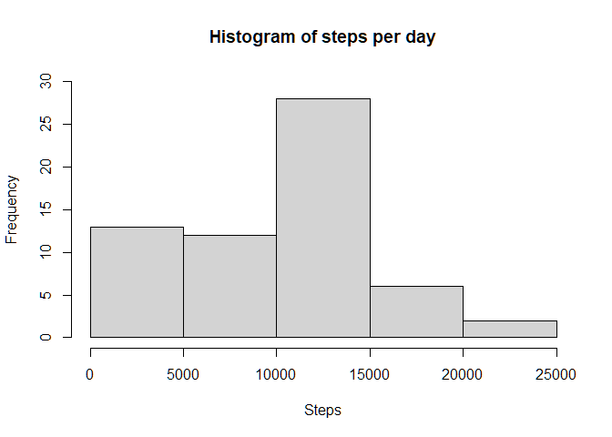
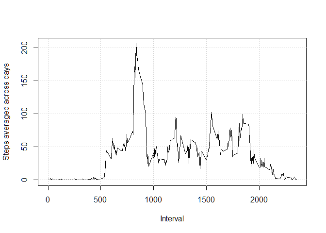
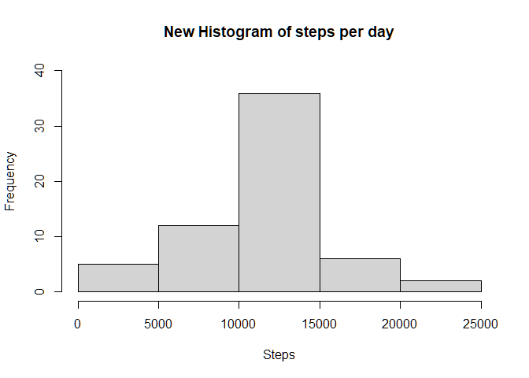
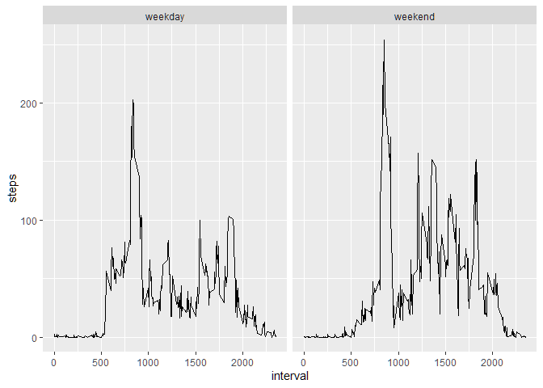

Reproducible Research: PA1
--------------------------

**Loading and preprocessing the data**

    #load libraries
    library(dplyr)

    ##
    ## Attaching package: 'dplyr'

    ## The following objects are masked from 'package:stats':
    ##
    ##     filter, lag

    ## The following objects are masked from 'package:base':
    ##
    ##     intersect, setdiff, setequal, union

    library(lubridate)

    ##
    ## Attaching package: 'lubridate'

    ## The following objects are masked from 'package:base':
    ##
    ##     date, intersect, setdiff, union

    library(ggplot2)
    #read data
    act <- read.csv("activity.csv", header=TRUE)
    #process data
    act$date <- as.Date(as.character(act$date), "%Y-%m-%d")

What is mean total number of steps taken per day?
=================================================

    tb <- act %>% group_by(date) %>% summarise(steps=sum(steps, na.rm=TRUE))

    ## `summarise()` ungrouping output (override with `.groups` argument)

**Make a histogram of the total number of steps**

    hist(tb$steps, ylim=c(0,30), xlab="Steps", main ="Histogram of steps per day")

**Calculate and report the mean and median of the total number of steps
taken per days **

mean:

    print(mean(tb$steps))

    ## [1] 9354.23

median:

    print(median(tb$steps))

    ## [1] 10395

What is the average daily activity pattern?
===========================================

**Make a time series plot of steps averaged across all days**

group data by interval and calculate the mean across groups

    tb2 <- act %>% group_by(interval) %>% summarise(mean=mean(steps, na.rm=TRUE))

    ## `summarise()` ungrouping output (override with `.groups` argument)

    plot(tb2$interval, tb2$mean, type="l", xlab="Interval", ylab="Steps averaged across days")
    grid()

**Which interval contains the maximum number of steps?**

    m <- max(tb2$mean)
    ans <- tb2 %>% filter(mean==m)
    print(ans[1,1])

    ## # A tibble: 1 x 1
    ##   interval
    ##      <int>
    ## 1      835

Imputing missing values
=======================

**Calculate and report the total number of missing values in the
dataset**

    naact <- act %>% filter(is.na(steps) | is.na(date) | is.na(interval))
    print(dim(naact))

    ## [1] 2304    3

So we have 2304 rows affected by NAs  
**Devise a strategy for filling in all of the missing values in the
dataset**  
First of all we need to find where NAs are

    naSteps <- act %>% filter(is.na(steps))
    naDate <- act %>% filter(is.na(date))
    nainterval <- act %>% filter(is.na(interval))
    print(dim(naSteps))

    ## [1] 2304    3

    print(dim(naDate))

    ## [1] 0 3

    print(dim(nainterval))

    ## [1] 0 3

Luckly only steps variable has NAs.  
Now we fill missing data in variable steps with the steps averaged
across 5-minute interval  
**Create a new dataset with the missing data filled in**

    ##completed rows in dataframe act
    notnaact <- act %>%filter(!is.na(steps))
    #fill missing data
    for(i in 1:nrow(naSteps)) {
          tmp1 <- filter(tb2, interval== naSteps[i,3])
          naSteps[i, 1]<- tmp1[1,2]
    }
    fillAct <- rbind(naSteps, notnaact)

**Make an histogram of the total numbers of steps taken per day**

    tb3 <- fillAct %>% group_by(date) %>% summarise(steps=sum(steps))

    ## `summarise()` ungrouping output (override with `.groups` argument)

    hist(tb3$steps, ylim=c(0,40), xlab="Steps", main ="New Histogram of steps per day")

**Calculate and report the mean and median total number of steps taken
for day**  
mean:

    print(mean(tb3$steps))

    ## [1] 10766.19

median:

    print(median(tb3$steps))

    ## [1] 10766.19

After imputing missing data, mean and median are identical; mean is higher  
\# Are there differences in activity patterns between weekdays and
weekends?  
**Create a new factor variable in dataset with two levels “weekday” and
“weekends”**

    fillAct$dType <- ifelse(wday(fillAct$date)>5, "weekend", "weekday")
    fillAct$dType <- as.factor(fillAct$dType)

**Make a time series plot of average number of steps taken, across
weekday days or weekend days**

    groupedAct <- aggregate(steps~interval + dType, fillAct, mean)
    g <- qplot(interval, steps, data= groupedAct, geom= "line", facets= .~dType)
    print(g)

